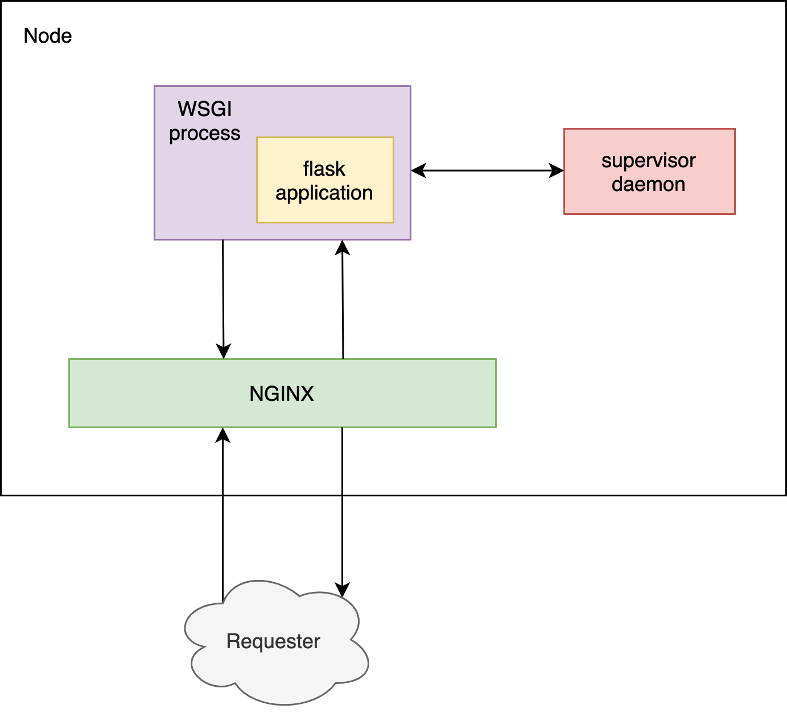

<!-- [Instance Life Cycle](https://docs.aws.amazon.com/opsworks/latest/userguide/registered-instances-lifecycle.html) -->

# Flask-WSGI-NGINX Cookbook

OpsWorks Cookbook for the Flask-WSGI-NGINX & supervisor server stack for Chef version 12.

## Attributes

Options to override the default Cookbook attributes.

### General

Basic cookbok setup properties.

| property               | description                                      | default value |
| ---------------------- | ------------------------------------------------ | ------------- |
| `project_root`         | Directory where project is placed in the node    | `"/srv/www/"` |
| `apt_packages`         | Extra aptitude packages to install on the node   | `[]`          |
| `pip_version`          | PIP version that's going to be installed         | `nil`         |
| `pip_install_flags`    | PIP install flags                                | `[]`          |
| `pip_ignore_installed` | Whether to ignore already installed PIP packages | `[]`          |
| `pip_force_reinstall`  | PIP packages to force reinstall                  | `[]`          |

### WSGI

The [Web Server Gateway Interface](https://en.wikipedia.org/wiki/Web_Server_Gateway_Interface) is a simple calling convention for web servers to forward requests to web applications or frameworks written in the Python programming language.

| property    | description                                          | default value |
| ----------- | ---------------------------------------------------- | ------------- |
| wsgi.server | WSGI server to use, one of [`"uwsgi"`, `"gunicorn"`] | `"gunicorn"`  |
| wsgi.module | The entrypoint Python module for WSGI                | `""`          |

### NGINX

[Nginx](https://www.nginx.com/) is a web server that can also be used as a reverse proxy, load balancer, mail proxy and HTTP cache.

| property                    | description                                            | default value |
| --------------------------- | ------------------------------------------------------ | ------------- |
| `nginx.allowed_user_agents` | Whitelisted user agents. If empty no filter is applied | `[]`          |
| `nginx.build_from_source`   | Whether or not to build NGINX from source              | `false`       |
| `nginx.version`             | NGINX version to be installed                          | `"1.16.1"`    |
| `nginx.enable_sse`          | Configure NGINX to support server-sent events          | `false`       |

### Supervisor

[Supervisor](http://supervisord.org/) is a client/server system that allows its users to monitor and control a number of processes on UNIX-like operating systems.

| property                    | description                                                                                          | default value |
| --------------------------- | ---------------------------------------------------------------------------------------------------- | ------------- |
| `supervisor.memmon.enabled` | Whether or not to enable the memory monitor (memmon)                                                 | `false`       |
| `supervisor.memmon.max_rss` | The maximum resident segment size (RSS). If the process is consuming more it's going to be restarted | `1000`        |
| `supervisor.memmon.email`   | Email address to notify when memmon restarts a process                                               | `""`          |
